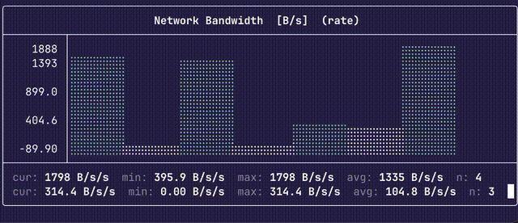
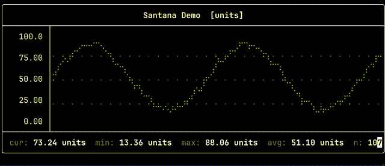
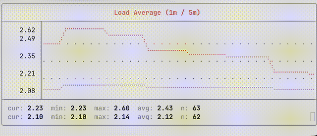
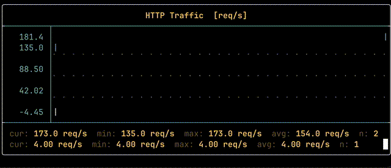

# Santana

<p align="left">
  
</p>
 ░▒▓███████▓▒░░▒▓██████▓▒░░▒▓███████▓▒░▒▓████████▓▒░▒▓██████▓▒░░▒▓███████▓▒░ ░▒▓██████▓▒░
░▒▓█▓▒░      ░▒▓█▓▒░░▒▓█▓▒░▒▓█▓▒░░▒▓█▓▒░ ░▒▓█▓▒░  ░▒▓█▓▒░░▒▓█▓▒░▒▓█▓▒░░▒▓█▓▒░▒▓█▓▒░░▒▓█▓▒░
░▒▓█▓▒░      ░▒▓█▓▒░░▒▓█▓▒░▒▓█▓▒░░▒▓█▓▒░ ░▒▓█▓▒░  ░▒▓█▓▒░░▒▓█▓▒░▒▓█▓▒░░▒▓█▓▒░▒▓█▓▒░░▒▓█▓▒░
 ░▒▓██████▓▒░░▒▓████████▓▒░▒▓█▓▒░░▒▓█▓▒░ ░▒▓█▓▒░  ░▒▓████████▓▒░▒▓█▓▒░░▒▓█▓▒░▒▓████████▓▒░
       ░▒▓█▓▒░▒▓█▓▒░░▒▓█▓▒░▒▓█▓▒░░▒▓█▓▒░ ░▒▓█▓▒░  ░▒▓█▓▒░░▒▓█▓▒░▒▓█▓▒░░▒▓█▓▒░▒▓█▓▒░░▒▓█▓▒░
       ░▒▓█▓▒░▒▓█▓▒░░▒▓█▓▒░▒▓█▓▒░░▒▓█▓▒░ ░▒▓█▓▒░  ░▒▓█▓▒░░▒▓█▓▒░▒▓█▓▒░░▒▓█▓▒░▒▓█▓▒░░▒▓█▓▒░
░▒▓███████▓▒░░▒▓█▓▒░░▒▓█▓▒░▒▓█▓▒░░▒▓█▓▒░ ░▒▓█▓▒░  ░▒▓█▓▒░░▒▓█▓▒░▒▓█▓▒░░▒▓█▓▒░▒▓█▓▒░░▒▓█▓▒░</pre>

*Work in progress*

Real-time terminal data visualization utility.

 
 


## Features

- **Three chart types**: line (braille-dot polyline), bar, sparkline
- **Auto-scaling** Y axis with optional fixed min/max
- **Stats footer**: current | min | max | mean | sample count
- **Color themes**: green, cyan, yellow, red, white
- **Responsive**: adapts to terminal resize instantly
- **ttyplot-compatible**: pipe any newline-delimited numeric stream

## Build

```bash
cmake -S . -B build -DCMAKE_BUILD_TYPE=Release
cmake --build build -j$(nproc)   # Linux
cmake --build build -j$(sysctl -n hw.logicalcpu)  # macOS
```

Requires: CMake ≥ 3.20, C++ (std 20) compiler. 
Dependencies (FTXUI v5.0.0, CLI11 v2.4.1) are fetched automatically.


## Usage

```
santana [OPTIONS]

Options:
  -h,--help                   Print this help message and exit
  -V,--version                Display program version information and exit
  -t,--title TEXT             Chart title
  -m,--mode TEXT:{line,bar,spark}
                              Chart type: line (default), bar, spark
  -u,--unit TEXT              Unit label (e.g. MB/s, %)
  --min FLOAT                 Fixed Y axis minimum (no error indicator)
  --max FLOAT                 Fixed Y axis maximum (no error indicator)
  -s,--scroll                 Scroll mode
  --history INT               Number of data points to keep (default: 120)
  --fps INT                   Target refresh rate (default: 16)
  --color TEXT:{green,cyan,yellow,red,white}
                              Chart color: green, cyan, yellow, red, white
  -2                          Read two values and draw two plots (second in contrasting color)
  -r,--rate                   Rate mode: divide value by elapsed time between samples (for counters)
  -c,--char TEXT              Character to use for plot line, e.g. @ # % . (default: braille)
  -e,--error-max-char TEXT    Character for error indicator when value exceeds hard max (default: e)
  -E,--error-min-char TEXT    Character for error indicator when value is below hard min (default: v)
  --hard-max FLOAT            Hard maximum: if exceeded draws error line and fixes upper scale
  --hard-min FLOAT            Hard minimum: if below draws error symbol and fixes lower scale
  --scale FLOAT               Initial soft Y axis scale (autoscale can exceed this)
  -C,--colors TEXT            Per-element colors: plot[,axes,text,title,max_err,min_err] (0-7)
                                or named scheme: dark1, dark2, light1, light2, vampire
                                Colors: 0=black 1=red 2=green 3=yellow 4=blue 5=magenta 6=cyan 7=white
```
## Examples

```bash
./examples/exp.sh            # standalone demo signal
./examples/exp.sh load       # system load (1m/5m)
./examples/exp.sh memory     # memory usage %
./examples/exp.sh network    # rx/tx throughput
./examples/exp.sh http       # synthetic HTTP traffic
```

