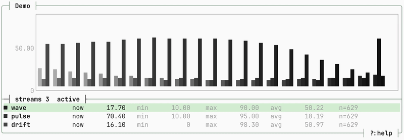
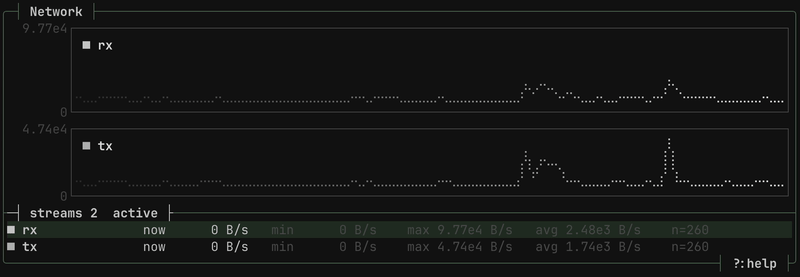

<p align="center">
  
</p>

<p align="center">santana is a realtime terminal data plotter for logs and numeric streams.</p>

<div align="center">
      
      
</div>

<p align="center">
    <a href="https://github.com/deepsoftworks/santana/stargazers"></a>
    <a href="https://github.com/deepsoftworks/santana/commits/main"></a>
    <a href="LICENSE"></a>
    <a href="#"></a>
</p>

## What It Does

Pipe output like `python main.py | santana` and Santana will auto-detect fields and plot them live in the terminal.

It understands:

- Single numeric values
- Whitespace-separated numeric rows
- CSV rows
- JSON objects and arrays
- Freeform logs with numeric fields, for example:

```text
[LOG] a=3, y=4 b:5; r 4
```

That line becomes four streams: `a`, `y`, `b`, and `r`.

## Build

Requires Rust 1.75+.

```bash
cargo build --release
```

The binary lands at `target/release/santana`.

## Usage

```bash
./target/release/santana [options]
```

### Common pipelines

```bash
# One value per line
yes 42 | santana

# Python logs with named fields
python main.py | santana

# Freeform logs
printf '[LOG] a=3, y=4 b:5; r 4\n' | santana

# JSON
printf '{"latency":12,"cpu":45}\n' | santana

# Counter streams (plot deltas/s)
./examples/network.sh | santana --title "Network" --unit B --rate

# Memory usage with fixed Y range
./examples/memory_usage.sh | santana --title "Memory" --unit % --min 0 --max 100

# Only chart fields matching a pattern
kubectl top pods --no-headers | santana --filter "cpu|memory"
```

### Options

```text
  -t, --title TEXT      Chart title [default: santana]
  -m, --mode TEXT       line, bar, spark, overlay, or split [default: line]
  -u, --unit TEXT       Unit label (e.g. MB/s, %)
      --min FLOAT       Fixed Y axis minimum
      --max FLOAT       Fixed Y axis maximum
      --log-scale       Logarithmic Y axis
      --history INT     Samples to keep per stream [default: 120]
      --fps INT         UI refresh rate [default: 16]
  -r, --rate            Plot deltas per second for counters
      --filter REGEX    Only capture fields whose keys match this pattern
      --theme TEXT      Color theme: dark, light, solarized, nord [default: dark]
```

### Interactive keys

| Key | Action |
|-----|--------|
| `q` / `Esc` | Quit |
| `m` | Cycle chart mode (line → bar → spark → overlay → split) |
| `r` | Toggle rate mode (delta/s) |
| `Space` | Pause / resume data ingestion |
| `+` / `-` | Zoom in / out |
| `,` / `.` | Pan left / right through history |
| `↑` / `↓` | Select stream |
| `t` | Toggle selected stream visibility |
| `y` | Lock / unlock Y-axis scale |
| `?` | Help overlay |
| `Ctrl+L` | Force redraw |

## Chart Modes

| Mode | Description |
|------|-------------|
| `line` | Braille-based line chart per stream |
| `bar` | Grouped vertical bars |
| `split` | Each stream in its own pane, auto-scaled independently |
